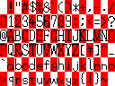

Generator
===

MEIMEIで利用する資源を生成するツールです。

```bash
mkdir -p build && cd build
cmake .. && cmake --build .
make install
```

<!-- ## Color

色を扱うためのソースコードを生成します。

<span style="color: #FFF499;">■</span>
<span style="color: #FDC26A;">■</span>
<span style="color: #F27133;">■</span>
<span style="color: #E8003E;">■</span>
<span style="color: #900047;">■</span>
<span style="color: #491A49;">■</span>
<span style="color: #1C1835;">■</span>
<span style="color: #01305E;">■</span>
<span style="color: #015582;">■</span>
<span style="color: #007F85;">■</span>
<span style="color: #34A975;">■</span>
<span style="color: #DAE567;">■</span>


## Font

フォントを扱うためのソースコードを生成します。




## Map

マップを扱うためのソースコードを生成します。

```
               #######
               #     #
               #     #
#######        ### ###
#     ######     # #
#          #  #### ####
#     #### #  #       #
#######  # ####       #
         #            #
         ######       #
              #########
``` -->
